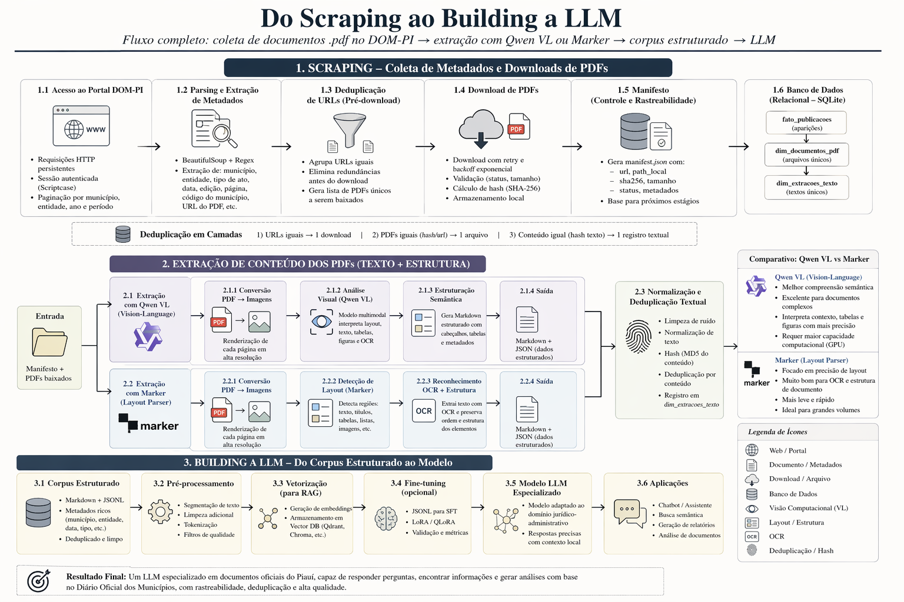

<div align="center">
  
</div>

# DOM-PI — Corpus do Diário Oficial dos Municípios do Piauí

Pipeline de construção de **corpus governamental em português** a partir das publicações
do **Diário Oficial dos Municípios do Piauí (DOM-PI)**, para uso em **LLM/RAG**. Vai do
*scraping* dos metadados e download dos PDFs à extração de texto acelerada por GPU e à
estruturação num *data lake* colunar, terminando num dataset pronto para treino.

**Resultado atual:** ~**80,8 mil documentos** · **~179 milhões de tokens** · **13 Territórios
de Desenvolvimento** (12 do DOM-PI dos Municípios **+ Teresina**, a capital) · publicações de
**2025**. Publicado no HuggingFace:
- [`gutoportelaa/dom-pi-corpus-2025`](https://huggingface.co/datasets/gutoportelaa/dom-pi-corpus-2025) — corpus de texto (configs `default`/`curated`/`raw`/`extraido`)
- [`gutoportelaa/dom-pi-pdfs-2025`](https://huggingface.co/datasets/gutoportelaa/dom-pi-pdfs-2025) — PDFs-fonte (~66 GB)
- [`gutoportelaa/dom-pi-teresina-2025`](https://huggingface.co/datasets/gutoportelaa/dom-pi-teresina-2025) — dataset isolado da capital (texto + PDFs)

> Relatório técnico completo da construção do corpus: **[`RELATORIO_CORPUS_DOM-PI.md`](RELATORIO_CORPUS_DOM-PI.md)**.

## Arquitetura do pipeline

```
scraping  →  download  →  reconstrução  →  EXTRAÇÃO (GPU/SLURM)  →  DATA LAKE  →  dataset
(metadados)  (PDFs)      (manifesto→     PyMuPDF + PaddleOCR/      extraído→limpo→  HF / treino
                          estrutura)      Docling (CUDA)            corpus
```

1. **Scraping** — `scraper_isolado.py` coleta metadados por município × entidade no portal DOM-PI (backend Scriptcase, sessões HTTP persistentes).
2. **Download / reconstrução** — `scrape_demais.sh` / `download_demais.sh` e `reconstruir_coleta.py` baixam os PDFs e remontam a estrutura por território/município a partir do manifesto.
3. **Extração (pesada, no cluster)** — `orquestrador_extracao.py` faz triagem com PyMuPDF e roteia para **PaddleOCR-CUDA** (escaneado) ou **Docling-CUDA** (fiscal/tabelas); roda no SLURM via `run_extracao.sbatch`.
4. **Data lake (leve, local/CPU)** — pacote `src/dompi_scraper/datalake/` (DuckDB + Polars + Parquet/zstd), com as camadas **extraído → limpo → corpus**.
5. **Publicação** — exporta Parquet + shards `.jsonl.zst` e sobe para o HuggingFace Hub.

## Estrutura do repositório

| Caminho | Conteúdo |
|---|---|
| `src/dompi_scraper/` | Pacote principal: orquestração, extração, limpeza, utilitários compartilhados |
| `src/dompi_scraper/datalake/` | Camadas do lake: `ingest_extraido`, `build_limpo`, `build_corpus`, `corrigir_datas`, `corrigir_municipios`, `query`, `catalog`, `io` |
| `src/dompi_scraper/territorios_pi.py` | Registro dos 13 Territórios de Desenvolvimento e municípios |
| `src/vector_db/` | Ingestão vetorial (ChromaDB / BM25) para RAG |
| `scraper_isolado.py`, `*.sh`, `run_extracao.sbatch` | Scripts de coleta, setup e jobs SLURM |
| `to-do_territorios.txt` | Lista oficial de municípios por território (fonte de canonização) |
| `docs/`, `RELATORIO_CORPUS_DOM-PI.md`, `CONTEXT*.md` | Documentação e relatórios |

> **Artefatos gerados não são versionados** (ver `.gitignore`): PDFs (`territorios/`), o data lake
> (`datalake/`), bases de treino (`db_treino_*`), bases vetoriais (`chroma_db*`), staging do lab
> (`staging_lab/`) e o pacote de publicação HF (`hf_corpus_dompi/`) são todos **regeneráveis** pela pipeline.

## Camadas do data lake

```
datalake/
  extraido/  territorio=<slug>/ano=<AAAA>/part-*.parquet   # 1 linha/doc + proveniência
  limpo/     territorio=<slug>/ano=<AAAA>/part-*.parquet   # texto limpo, re-hash, dedup, flags
  corpus/    corpus_llm/ part-*.parquet (+ shards .jsonl.zst)  # pronto p/ treino
  _catalog/  manifest.parquet · dedup_global.parquet
```

CLI (tudo CPU-leve, roda local):

```bash
python -m dompi_scraper.datalake.ingest_extraido   --territorio <slug>   # ou --all
python -m dompi_scraper.datalake.build_limpo        --territorio <slug>   # ou --all
python -m dompi_scraper.datalake.build_corpus       # fatia compilações + dedup near-dup → train+raw
python -m dompi_scraper.datalake.empacotar_hf       # empacota hf_corpus_dompi/ (upload manual)
python -m dompi_scraper.datalake.query "SELECT territorio, count(*) FROM corpus GROUP BY 1"
```

## Setup do ambiente

Gerenciado com **uv** (Python ≥ 3.12).

```bash
uv sync                 # instala dependências a partir do uv.lock versionado
```

No cluster (GPU, sem AVX2), use `setup_venvs.sh` para os venvs `.venv` / `.venv-paddle`.
**Atenção:** a extração nunca deve ser executada via `uv run`; use o interpretador do venv
diretamente (`./.venv/bin/python -m ...`).

## Dataset publicado

```python
from datasets import load_dataset
ds = load_dataset("gutoportelaa/dom-pi-corpus-2025", split="train")
ds = ds.filter(lambda r: r["territorio"] == "cocais")   # filtrar por território
```

Colunas: `id`, `territorio`, `municipio` (nome oficial canonizado), `tipo_ato`, `ano`,
`data_publicacao`, `n_tokens`, `tamanho_classe`, `texto`. Config `default`/`train` é
deduplicado (near-dups removidos) e com compilações fatiadas em atos; config `raw` traz
tudo + `cluster_id`/`is_near_dup`. Licença **CC-BY-4.0**.

## Licença

Código sob a licença do arquivo [`LICENSE`](LICENSE). Os textos do corpus são atos oficiais
públicos, redistribuídos sob CC-BY-4.0 — atribua à fonte (DOM-PI / municípios do Piauí).
